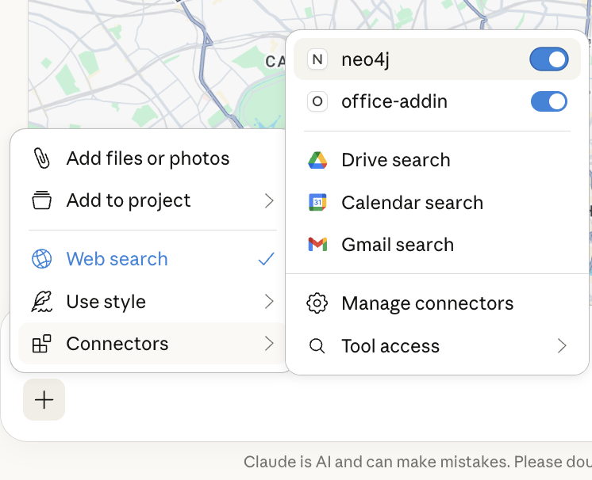
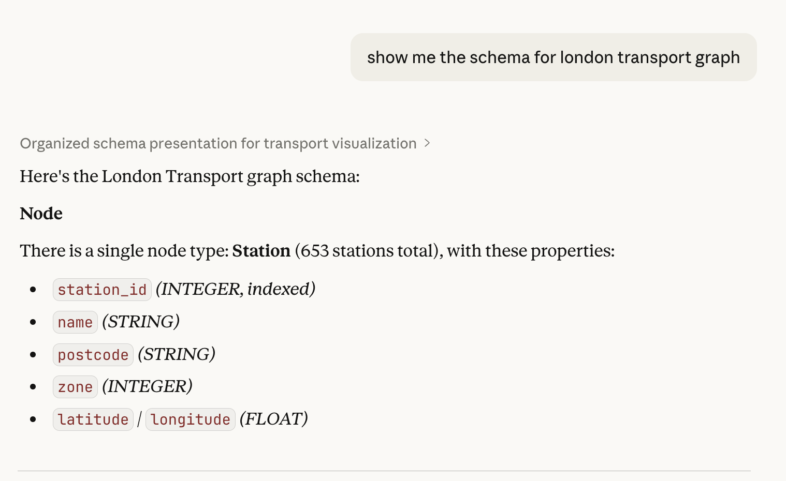
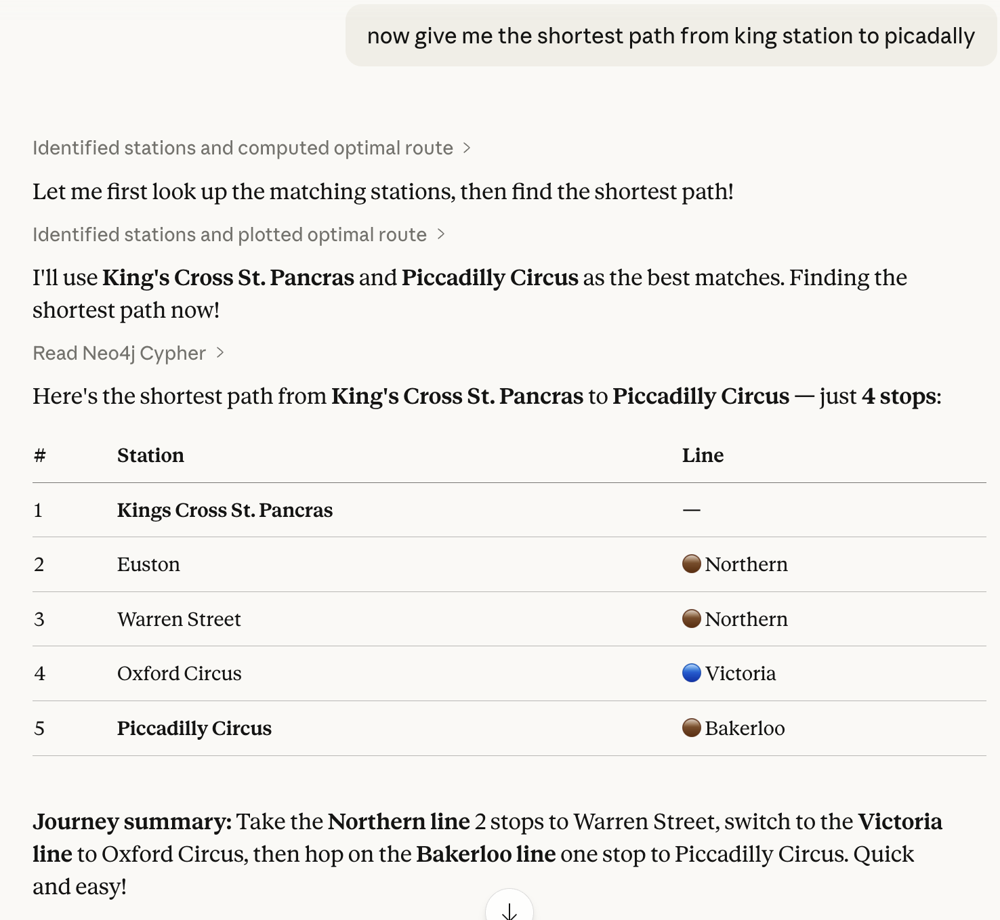
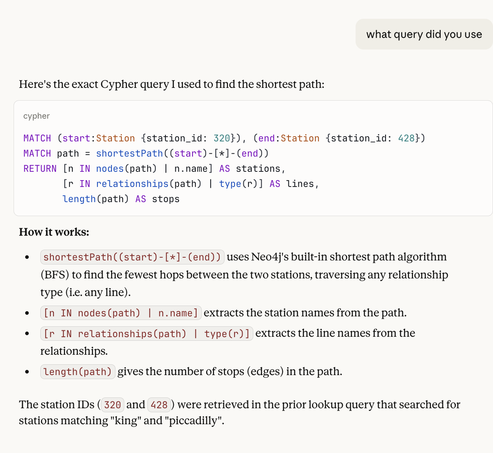
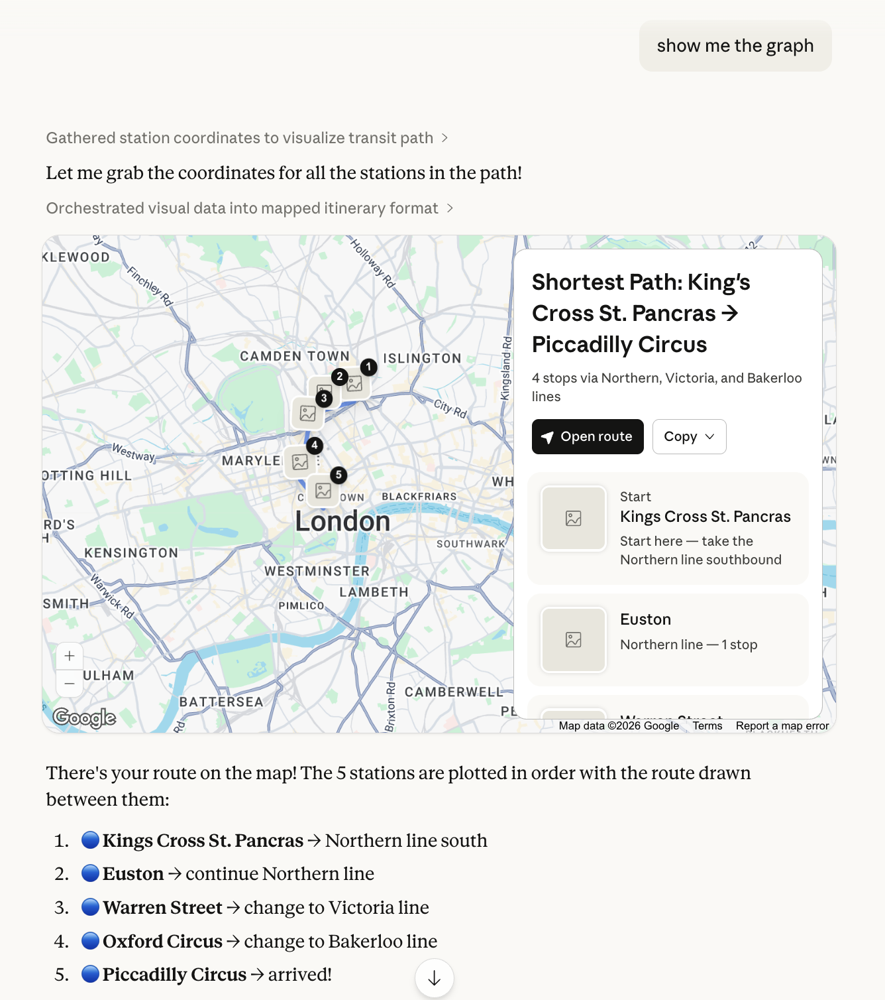
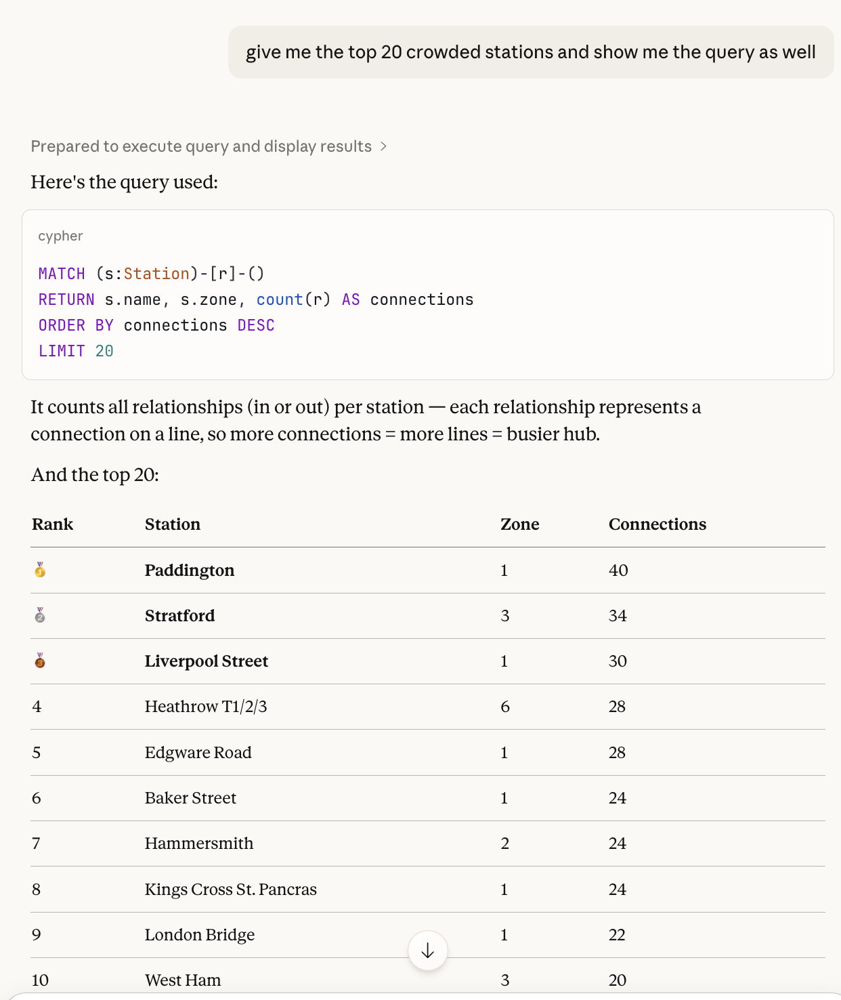
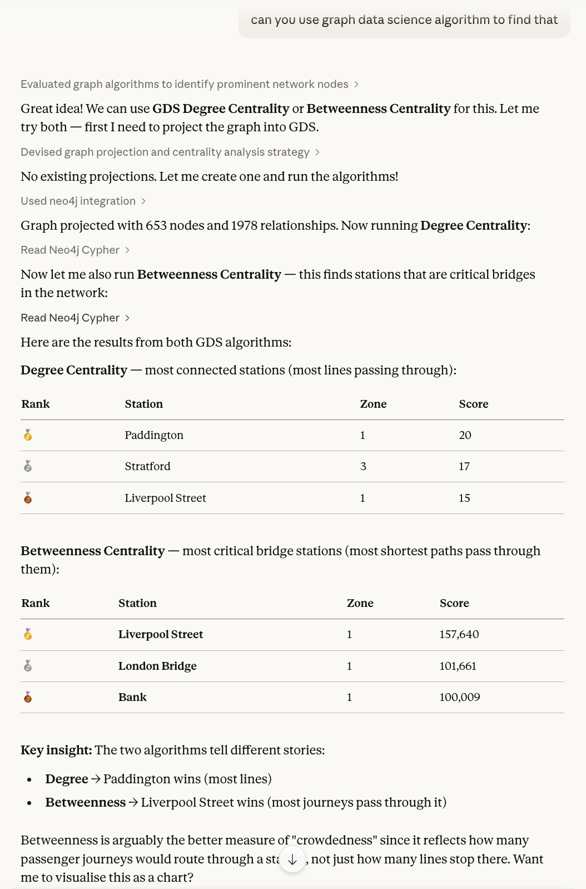
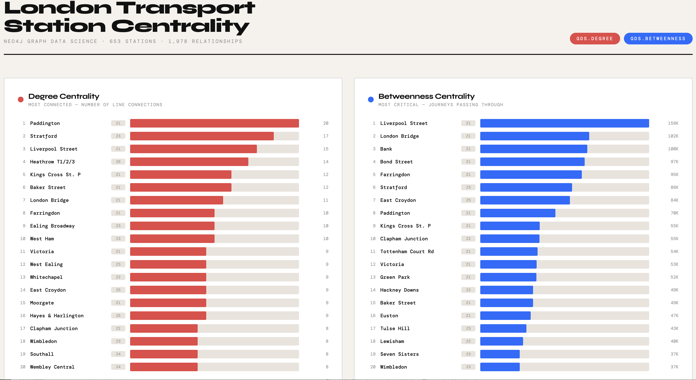
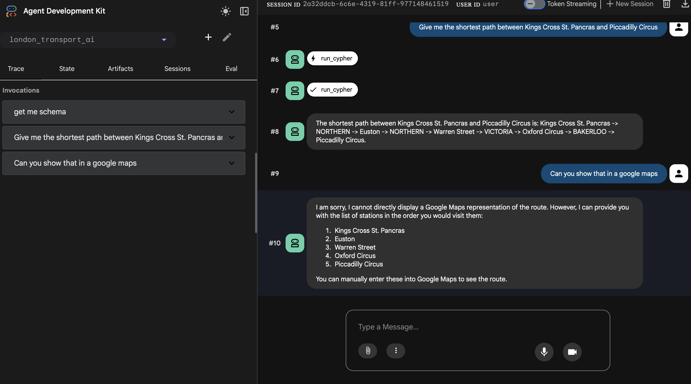

# Neo4j + AI Integration (MCP + Claude Desktop, Google ADK)

## Overview
This project demonstrates how to connect Neo4j AuraDB to modern AI assistants using the Model Context Protocol (MCP).

It enables natural language questions to be translated into Cypher queries and executed directly against a live graph database.


## Prerequistics 
1.	Neo4j AuraDB instance
2.	Claude Desktop installed
3.	Python 3.10+
4.	uv (https://github.com/astral-sh/uv)


## Setup
# Install uv:
    brew install uv

# Configure Claude Desktop MCP
Open Claude Desktop → Settings → Developer → Edit Config

Add the following to claude_desktop_config.json:
```
    {
    "mcpServers": {
        "neo4j": {
        "command": "uvx",
        "args": [
            "mcp-neo4j-cypher",
            "--db-url", "neo4j+s://<YOUR_AURA_ENDPOINT>",
            "--username", "neo4j",
            "--password", "<YOUR_PASSWORD>"
        ]
        }
    }
    }
```

# Start Claude Desktop 


# Ask questions 



















---

# Quick Google ADK setup 

## Install ADK 

```
    python3 -m venv .venv
    source .venv/bin/activate
    pip install google-adk neo4j
```

## Get to parent directory and run adk on your terminal window 

```
   adk web 
```

## On your browser, start asking questions. agent.py has very minimal code just to check 


